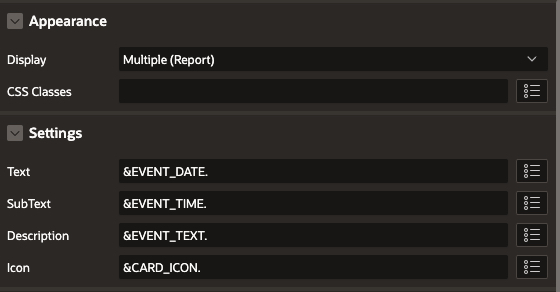
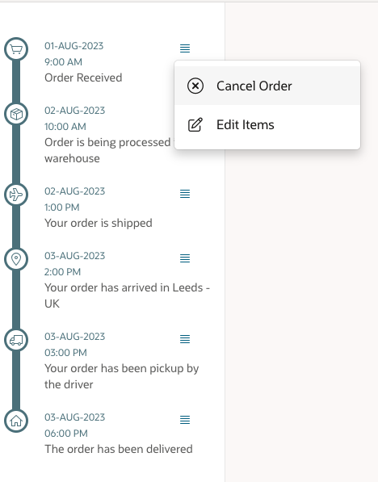

# Oracle APEX Vertical Timeline Plugin
Great timeline plugin with menu

## Installation ##
Import *template_component_plugin_com_rodrigomesquita_vertical_timeline.sql* file into your application.

## Usage ##
1. Create a page item
2. Choose Vertical Timeline[Plugin]* as an template component type

## Sample Query ##
```
SELECT
  'Order Received' AS event_text,
  '01-AUG-2023' AS event_date,
  '9:00 AM'  as event_time,
  'fa-shopping-cart' as card_icon,
  'Y' edit_flag,
  'Y' cancel_flag,
  'N' track_flag,
  'N' review_flag,
  'N' return_flag
FROM DUAL
UNION ALL
SELECT
  'Order is being processed in our warehouse' AS event_text,
  '02-AUG-2023' as event_date,
  '10:00 AM'  as event_time,
  'fa-package' as card_icon,
  'N' edit_flag,
  'Y' cancel_flag,
  'N' track_flag,
  'N' review_flag,
  'N' return_flag
FROM DUAL
UNION ALL
SELECT
  'Your order is shipped' AS event_text,
  '02-AUG-2023' as event_date,
  '1:00 PM' as event_time,
  'fa-plane' as card_icon,
  'N' edit_flag,
  'N' cancel_flag,
  'Y' track_flag,
  'N' review_flag,
  'N' return_flag
FROM DUAL
UNION ALL
SELECT
  'Your order has arrived in Leeds - UK' AS event_text,
  '03-AUG-2023' as event_date,
  '2:00 PM' as event_time,
  'fa-map-marker-o' as card_icon,
  'N' edit_flag,
  'N' cancel_flag,
  'Y' track_flag,
  'N' review_flag,
  'N' return_flag
FROM DUAL
UNION ALL
SELECT
  'Your order has been pickup by the driver' AS event_text,
  '03-AUG-2023' as event_date,
  '03:00 PM' as event_time,
  'fa-truck' as card_icon,
  'N' edit_flag,
  'N' cancel_flag,
  'Y' track_flag,
  'N' review_flag,
  'N' return_flag
FROM DUAL
UNION ALL
SELECT
  'The order has been delivered' AS event_text,
  '03-AUG-2023' as event_date,
  '06:00 PM' as event_time,
  'fa-home' as card_icon,
  'N' edit_flag,
  'N' cancel_flag,
  'N' track_flag,
  'Y' review_flag,
  'Y' return_flag
FROM DUAL


```
 

## Preview ##


## Demo ##
https://bit.ly/VerticalTimeLine

